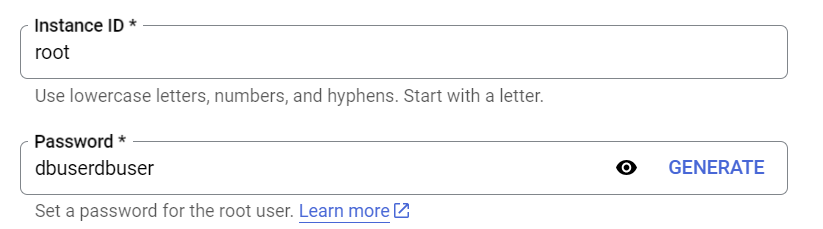
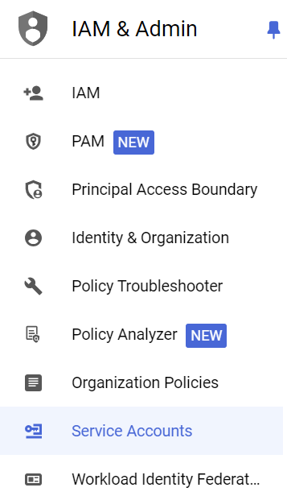
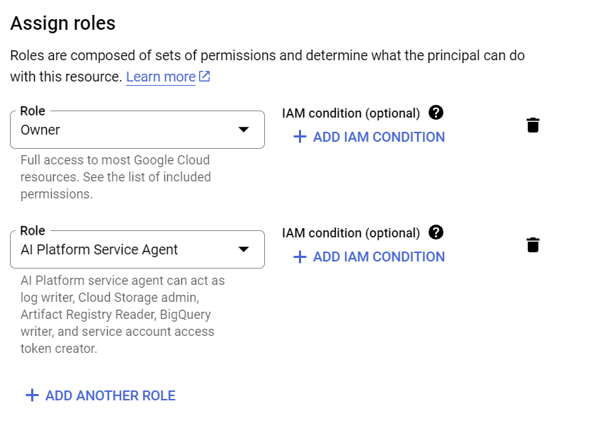
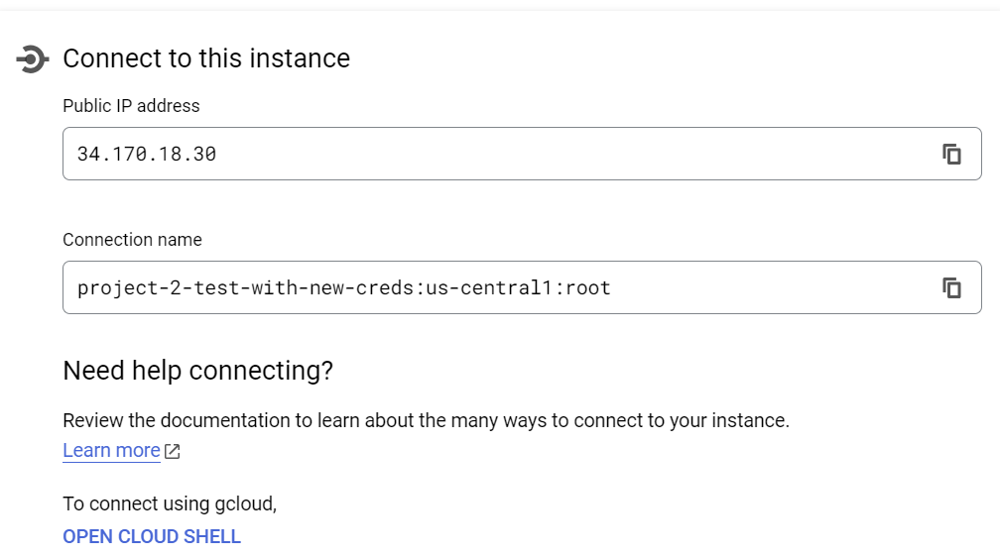
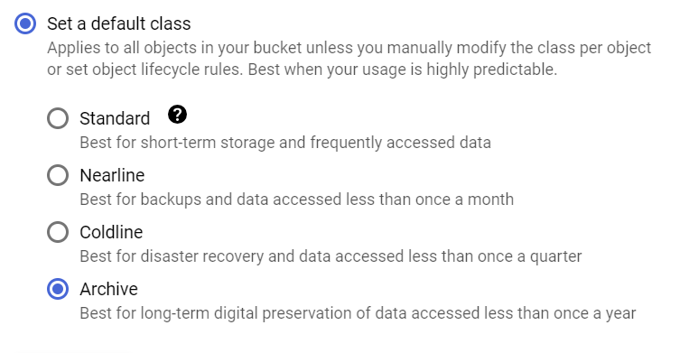

## HOW TO SET UP FROM SCRATCH
First, you will need to reinstantiate credentials with your Google account to run the website.
 1. Clone this repository.
 1. Create a [Google Cloud handle](https://cloud.google.com/?hl=en) for your account, enter a credit card to start the free trial. Don't worry, the $300 they give you should cover all work you need to do.
 1. Delete every file in the creds/ folder
 1. Follow [this link's instructions](https://cloud.google.com/docs/authentication/application-default-credentials) with your Google account that you registered.
 1. Move the file from its local location (Windows: %APPDATA%\gcloud\application_default_credentials.json, Linux: $HOME/.config/gcloud/application_default_credentials.json) to the creds folder with the following command in a Terminal window positioned at oddai_website:

        Windows Terminal - 
        copy %APPDATA%\gcloud\application_default_credentials.json  creds\
        Windows Powershell -
        copy $env:appdata/gcloud/application_default_credentials.json creds/

        Linux - 
        cp $HOME/.config/gcloud/application_default_credentials.json creds/

 1. Go to [console](https://console.cloud.google.com/) and create a new project
 1. Create a [Cloud SQL Instance](https://cloud.google.com/sql/docs/mysql/create-instance)
 1. Choose Enterprise and Sandbox mode, as shown below:
    
 1.  Use MySQL version 8.0, make the root user have password dbuserdbuser
    
 1. Create a Service Account under IAM and Admin. Give it Owner and AI Platform Service Agent roles.
    
    
10. Click on the newly created service account and go to Keys. Make one in JSON format (default)
11. Move that file into the creds folder. Make sure you have deleted any other keys besides that and application_default_credentials.json for your account.
12. Go back to dashboard and click on SQL. After going to your newly created project, copy the 'Connection Name'. 

Go into dep.py and replace INSTANCE_CONNECTION_NAME with that string.
13. Go back to the Google Cloud dashboard and select [Cloud Storage Buckets](https://console.cloud.google.com/storage/)
14. Click on 'Create' and give it a unique name.
15. Continue along the setup process until you see 'Choose a storage class'. Select 'Archive' - it's more than sufficient for this purpose, and ensures no overdraft charges

16. Confirm through until you've created your bucket. Copy the name and paste into the BUCKET_NAME variable in dep.py.
17. Remove the line for the function getconn() under connect_with_connector() that starts with db=DB_NAME . With a terminal over that folder, type $ streamlit run Sign_In.py into the terminal. Once the code has run once successfully, add that line back in again.
18. All done. If everything has gone to plan, you should see the sign in page pop up on your browser, or at http://localhost:8501/ . If not, contact mjstraus2304@gmail.com for support.

To access model training, on a computer with GPU (eg Linux ones in HPCL):
1. Navigate to oddai_website on terminal
2. Run $ pip install -r requirements.txt
3. Run $ streamlit run Sign_In.py
4. On the opening page, use username = Public, password = Franklin2304!
5. Go to Add Roboflow and Train Models tabs that appear on sidebar

To deploy/make publically accessible:
1. [Fork this repository](https://docs.github.com/en/pull-requests/collaborating-with-pull-requests/working-with-forks/fork-a-repo)
2. Put $ streamlit run Sign_In.py into the console
3. Click on Deploy in the upper right hand corner
4. Follow the steps and wait. Should work, but if not you can also look into [Google Cloud Run](https://cloud.google.com/run/) and Docker containers (the Dockerfile is already in the repo from previous attempts). Common issues involve requirements.txt, so make sure all package versions are workable. The Live Annotation feature is very fragile, so you may want to swap that out.
